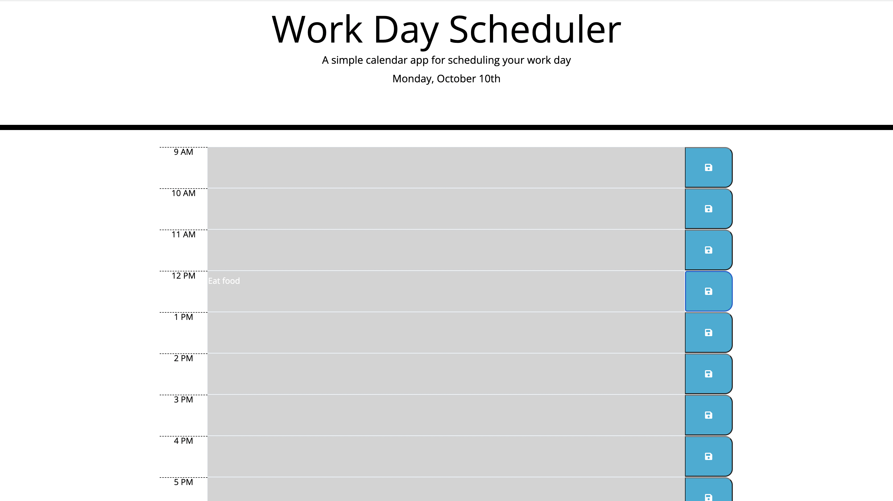

# Work Day Scheduler

## Description

Creating a work day calendar application which will run in the browser. This application using HTML which is linked to Css and functions with jQuery can be updated dynamically to enable the users to save events and tasks for each hour of the day.

## Acceptance Criteria

`
> This calender's should display the current day on top of the calander
> There should be timeblocks for standard business hours (9 AM to 5 PM)
> There should be color coded timeblock to show past, present and future in different color
> By clicking in the timeblock useres should be able to enter their tasks for that time
> Users should be able to save the event which they have entered in the timeblock
> By saving the task in the timeblock, it should be save in the local storage
> Users should be able to see what they have saved after refreshing the calander app page

## Screenshot

## Licence
MIT Licence, 2022 version
